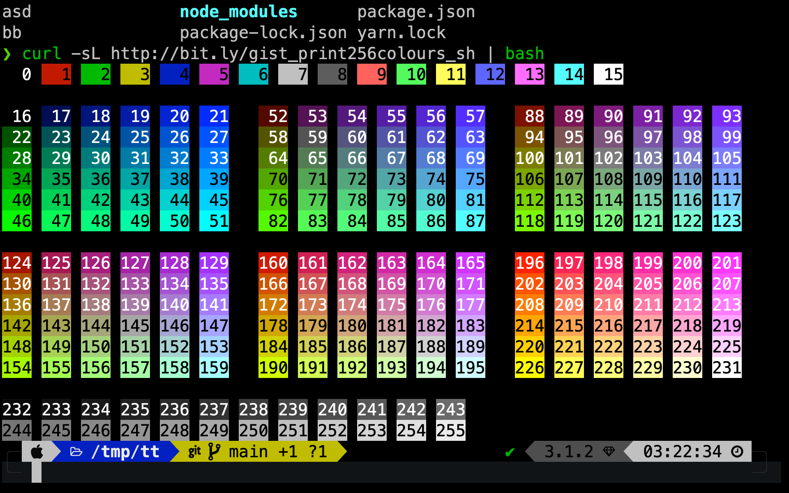
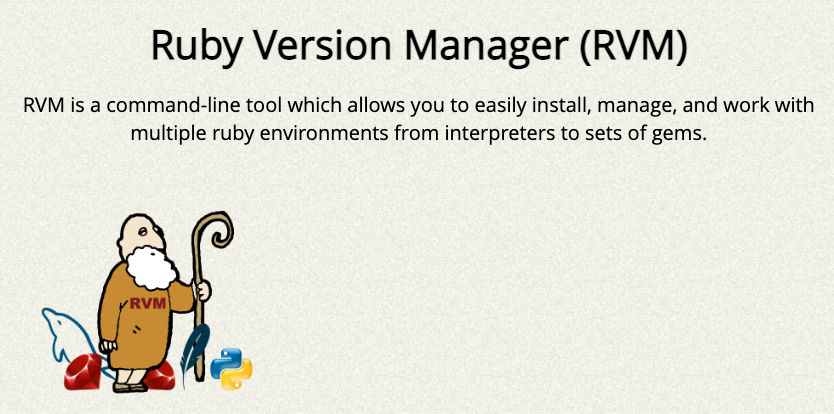
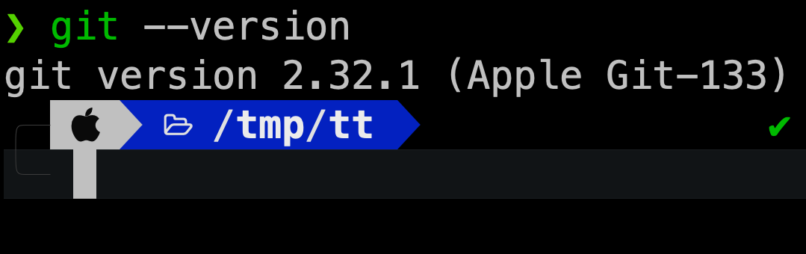
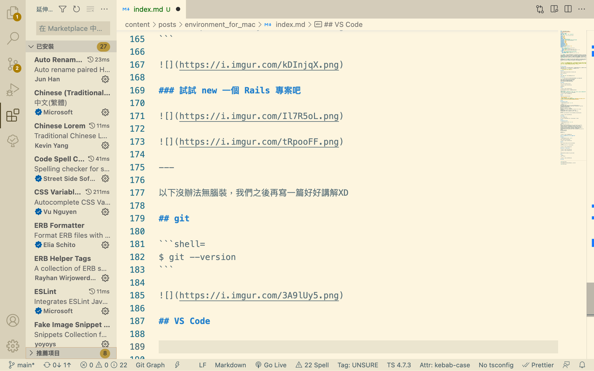

從[第一篇文章](../install-hugo)可以知道我是在 WSL(Windows Subsystem for Linux)上寫文章的，體驗了一個多月下來，以 Windows 進行練習，除了 路徑問題(檔名含中文等 unicode 字元) 終端機環境整合(powershell wsl zsh) 檔案系統(CRLF 刪檔案速度) 畫面分享(AppleTV 不給連？) 外也沒那麼不堪，而憑藉著從小電腦課的主場優勢~~有人學校是滿滿的 Mac 嗎~~，加上[微軟這幾年擁抱開源](https://github.com/microsoft)下，似乎不需要有寫程式就是要拿蘋果的焦慮感。

話雖如此，為了實際驗證都市傳說，我找回了自從開始打遊戲就被扔在角落，2015 年初版 Mac book，運氣不錯，剛好在[支援清單](https://support.apple.com/zh-tw/HT212551)內，現在就讓我們一起感受，標榜軟硬整合、使用者體驗的蘋果電腦能帶來的威力吧。

---

> 安裝環境是每位工程師避之唯恐不及的苦差事，如果你還沒有體驗到~~可能是你有個工具人好朋友~~，在程式語言中重複的事情可以抽出成為函數，現在把視野放遠，要快速安裝好環境~~你可以寫 shell script~~，就靠自己寫成文章，送給未來的你一點小確幸吧。

---

## Terminal 終端機

相較於視窗程式採用ＧＵＩ環境操作，透過滑鼠點擊元素，終端機採用ＣＬＩ介面操作，接受指令的速度有著天壤之別，想想在ＬＯＬ裡，你會用滑鼠點擊技能列再施放嗎

> 行有餘力可以學學 Vi/Vim 讓你不明覺厲

### iTerm2

相較於系統原生的 Terminal，有更多的設定可以調整。

https://iterm2.com/

### zsh

相較於原生的 `Bash` shell，有著更豐富的設定。

### oh-my-zsh

讓 `zsh` 聲名大噪的套件，擁有華麗的畫面與各種快速鍵設定、錯誤提示等。

- https://ithelp.ithome.com.tw/articles/10192899
- https://medium.com/statementdog-engineering/prettify-your-zsh-command-line-prompt
- https://github.com/romkatv/powerlevel10k



## Homebrew

https://brew.sh/index_zh-tw.html


套件管理系統

## RVM



Ruby 的版本管理系統，讓你針對專案快速切換不同版本。

- https://rvm.io/
- [從色彩繽紛到只看亂碼日子，學程式從 Ruby 出發！ | Day 02 | 環境安裝 不可少的 RVM](https://ithelp.ithome.com.tw/articles/10216350)


### GPG

簽章驗證，好像 Mac 預設沒安裝。

- https://gnupg.org/
- https://zh.wikipedia.org/zh-tw/GnuPG
- [網管人 | 善用信任網路機制　開源 GPG 輕鬆加解密](https://www.netadmin.com.tw/netadmin/zh-tw/technology/ECAB5085E27B4D8BB1DA15EE7A628F97)

## Ruby

### 透過 RVM 安裝 Ruby

現在時間８月１５日，安裝的是 `3.1.2` 版

```shell=
$ rvm install 3.1.2
## No binary rubies available for: osx/12.5/x86_64/ruby-3.1.2.
## Continuing with compilation. Please read 'rvm help mount' to get more information on binary rubies.
## Checking requirements for osx.
## ...
## Install of ruby-3.1.2 - #complete
## Ruby was built without documentation, to build it run: rvm docs generate-ri
## Making gemset ruby-3.1.2 pristine - please wait
## Making gemset ruby-3.1.2@global pristine - please wait

$ ruby -v
## ruby 3.1.2p20 (2022-04-12 revision 4491bb740a) [x86_64-darwin21]
```


### rubygems

https://rubygems.org/

下載 Ruby 相關的套件，如同 npm <-> Node.js、pip <-> Python

## Rails

### 透過 gem 下載 Rails

現在時間８月１５日，安裝的是 `6.1.2` 版

```shell=
$ gem install rails -v 6.1.2
## ...
## Done installing documentation for rack, concurrent-ruby, sprockets, zeitwerk, tzinfo, i18n, activesupport, nokogiri, crass, loofah, rails-html-sanitizer, rails-dom-testing, rack-test, erubi, builder, actionview, actionpack, sprockets-rails, thor, method_source, railties, mini_mime, marcel, activemodel, activerecord, globalid, activejob, activestorage, actiontext, mail, actionmailer, actionmailbox, websocket-extensions, websocket-driver, nio4r, actioncable, rails after 46 seconds
## 37 gems installed
## Time: 0h:01m:15s

$ rails -v
## Rails 6.1.6
```


### but, 要能成功啟動 Rails Server 還需要幾件事

### Node.js

現在時間８月１５日，安裝的是 `v16` 版

https://nodejs.org/en/download/


### yarn

https://ithelp.ithome.com.tw/articles/10191745

```shell=
$ sudo npm install yarn --location=global
```


### 試試 new 一個 Rails 專案吧


---

以下沒辦法無腦裝，我們之後再寫一篇好好講解 XD

## git

```shell=
$ git --version
```



## VS Code


