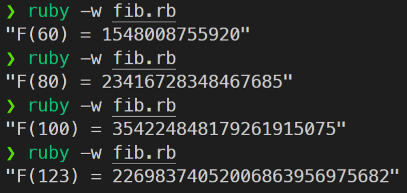
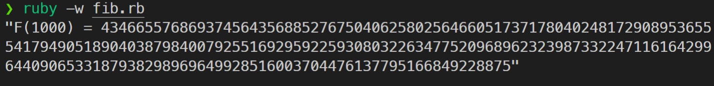

## 什麼情境

在網站開發過程中，除了是靜態網頁（例如現在觀看的部落格）之外，免不了會有依使用者瀏覽行為，而動態響應的資料。

常見的動態資料來源有

- JS 動態產生
- 向內部資料庫查詢
- 向外部網站查詢

而當程式重複執行條件相同的查詢時，雖然會因資料庫設計，返回快取結果，但如果能在本地確認這筆查詢已經做過，並直接讀取，即可加速網站讀取的速度。

這種記錄執行結果並在之後可以重複讀取的手法便稱為 **Memorization** 。

## 如何使用

例如在頁面中利用方法 `current_user` 來向資料庫查詢並回傳一個 `User` 物件，並在頁面中多次呼叫 `current_user` 來產生 `User` 相關的資料，為了避免重複查詢資料庫，可以將以下程式碼

```ruby
def current_user
  @_user = User.find_by(id: session[:user_session])
end
```

修改成

```ruby
def current_user
  @_user ||= User.find_by(id: session[:user_session])
end
```

其中的 `A ||= B` 等價於 `A = (A || B)`
因為在 `||(or)` 判斷中，由左至右，如果元素為真(Truthy)，則返回該元素，之後的程式碼將略過不執行，以此來看上面執行的結果， `current_user` 的回傳值會是：

若 `@_user` 為真，回傳 `@_user` ，否則回傳 `User.find_by(id: session[:user_session])`

---

對於網站來說，假設一個搜尋站內商品的輸入框，透過觀察使用者輸入文字變化後，至後臺撈取符合前綴的查詢結果，渲染至畫面上以表現 `autocomplete` 的效果。此時便能以 `Memorization` 手法記錄曾經查詢的結果，當使用者按下刪除鍵移除字元時，不須再次查詢資料庫而是從記憶體直接取出。

---

## 順帶一提

在處理遞迴程式碼時，如果觀察到拆解出的部分結果都相等，也可以運用此手法加速並降低呼叫堆疊數。以經典的遞迴題目-求費氏數列的值為例

遞迴寫法

```ruby
class Solution
  def self.fib(num)
    if num < 2
      num
    else
      fib(num - 1) + fib(num - 2)
    end
  end
end
n = 43
p "F(#{n}) = #{Solution.fib(n)}"
```

當 n = 43 時，已經要跑 43 秒才能結束。

而如果將算過的數字記錄下來

```ruby
class Solution
  @@memo = [0, 1]

  def self.fib(num)
    if @@memo.size > num
      @@memo[num]
    else
      @@memo << fib(num - 1) + fib(num - 2)
      @@memo.last
    end
  end
end
n = 60
p "F(#{n}) = #{Solution.fib(n)}"
```



答案瞬間就可以計算完成，甚至計算到千位也沒問題。


