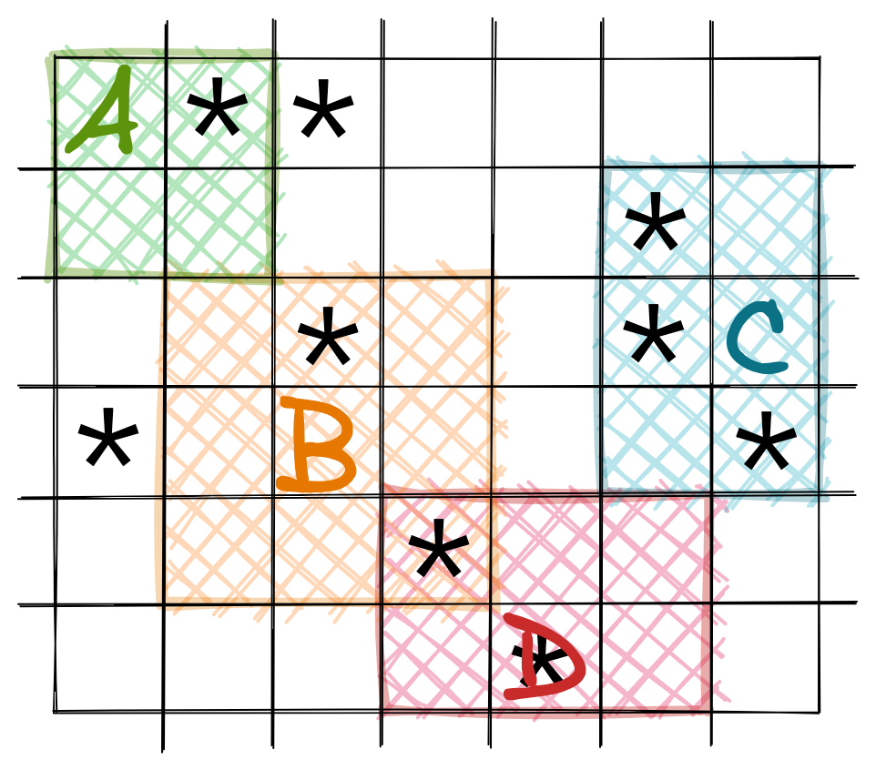

順便推坑一下踩地雷 [連結](https://minesweeper.online/tw/)


(https://minesweeper.online/tw/game/1390423794)

## Description

> In the popular **Minesweeper** game you have a board with some mines and those cells that don't contain a mine have a number in it that indicates the total number of mines in the neighboring cells. Starting off with some arrangement of mines we want to create a **Minesweeper** game setup.

## Example

For

```
matrix = [[true, false, false],
          [false, true, false],
          [false, false, false]]
```

the output should be

```
solution(matrix) = [[1, 2, 1],
                    [2, 1, 1],
                    [1, 1, 1]]
```

## Input/Output

- **[execution time limit] 4 seconds (rb)**

- **[input] array.array.boolean matrix**

  A non-empty rectangular matrix consisting of boolean values - `true` if the corresponding cell contains a mine, `false` otherwise.

  Guaranteed constraints:
  `2 ≤ matrix.length ≤ 100`,
  `2 ≤ matrix[0].length ≤ 100`.

- **[output] array.array.integer**

  Rectangular `matrix` of the same size as matrix each cell of which contains an integer equal to the number of mines in the neighboring cells. Two cells are called neighboring if they share at least one corner.

給定一個二維陣列，元素表示該格是否為地雷，要回傳一個二維陣列，元素為周圍的地雷數（踩地雷遊戲裡的數字）

## First try

格子內的數字 ＝ 周遭 8 格的地雷數

因此找出上下左右的 index，將範圍內地雷數(true)加總

因為會加到自己，所以如果本身格子是地雷的話，上面算出的數字 − 1

[](https://excalidraw.com/#json=L8VQnItX1iQQRfZiSAwSc,1uFbghHRp6kf9JV7Gg8v6w)

如上 `A: 1, B: 2, C: 3, D:1`

```ruby
def solution(matrix)
  max_x = matrix[0].size
  max_y = matrix.size
  result = matrix.map.with_index { |row, idx|
    row.map.with_index { |cell, inner_idx|
      mines = 0
      mines -= 1 if cell
      top, right, bottom, left = idx - 1, inner_idx + 1, idx + 1, inner_idx - 1
      range = {
        top: top,
        right: right,
        bottom: bottom,
        left: left
        }
        .transform_values { |value| value < 0 ? 0 : value }
      range[:right] -= 1 if range[:right] == max_x
      range[:bottom] -= 1 if range[:bottom] == max_y

      range.values
      mines + matrix[range[:top], range[:bottom] - range[:top] + 1].map { |row| row[range[:left], range[:right] - range[:left] + 1]}.flatten.count(true)
    }
  }
end
```

## 整理一下

上面對陣列 slice 切出往外一圈的範圍

不過我們也可以直接讀取周圍 8 格的資訊

```ruby
def solution(matrix)
  directions = [
    [-1, -1], [-1, 0], [-1, 1],
    [ 0, -1],           [0, 1],
    [ 1, -1],  [1, 0],  [1, 1],
  ]
  max_idx = matrix.size - 1
  max_inner_idx = matrix[0].size - 1

  result = matrix.map.with_index { |row, idx|
    row.map.with_index { |cell, inner_idx|
      directions.reduce(0) { |mines, dir|
        x, y = idx + dir[0], inner_idx + dir[1]
        if (x>=0 && x<=max_idx) && (y>=0 && y<=max_inner_idx) && matrix[x][y]
            mines += 1
        end
        mines
      }
    }
  }
end
```

> 附註：有空做一個踩地雷網站玩玩看 XD
